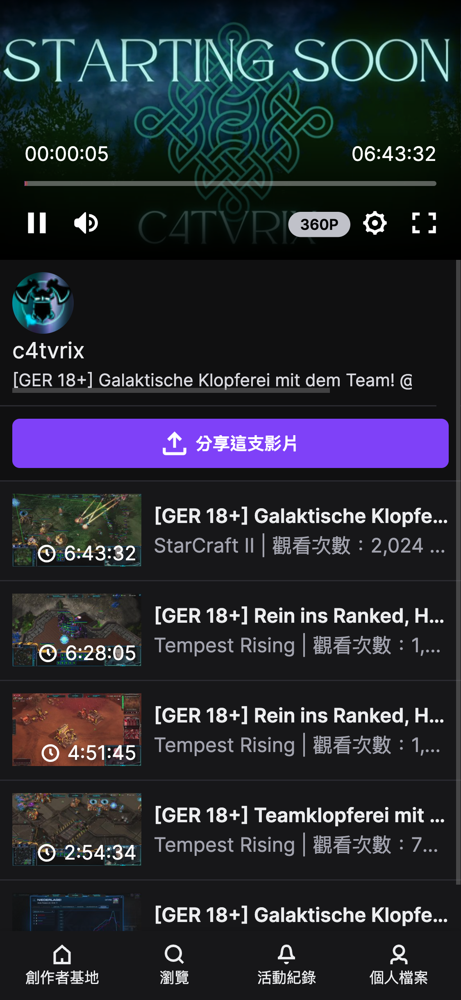

# OpenNet - HW - WAP

## How to execute

- Setup development packages

```bash
pip install -r requirements-dev.txt
pre-commit install
```

- Execution

```bash
pytest tests/main --alluredir=./reports
```

### Linter

run `make check` every time to make sure the linter is passed.

the command will check

- flake8

- black

- mypy

### Directory Structure

We use [Page object Pattern](https://www.selenium.dev/documentation/test_practices/encouraged/page_object_models/) in this structure

```txt
.
├── locators/               # All element locator in this folder 
├── makes/                  # all make files
│   ├── dev.mk              # development command. linter check
├── pages/                  # all pages 
│   ├── common.py           # basic selenium command. ex: find_elements
│   ├── main_page.py        # all function in main page
│   ├── player_page.py      # all function in player page
│   ├── search_result_page.py # all function in search result page
├── reports/                # the file for generating Allure report
├── screenshots/            # screenshot from cases
├── tests/                  # all test suites
├── conftest.py             # setup driver in the session
├── Makefile                # include all make files
├── README.md
├── requirements.txt        # package for running this test
```

### Test result

- 

<video width="320" height="240" controls>
  <source src=./screenshots/WAP.mov type="video/quicktime">
  Your browser does not support the video tag.
</video>https://file+.vscode-resource.vscode-cdn.net/Users/esthertsai/Desktop/opennet_homework/OpenNet_WAP/screenshots/video.png
